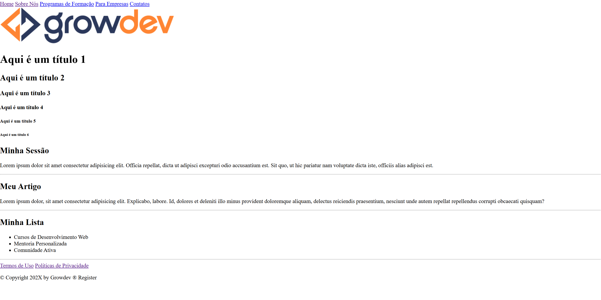
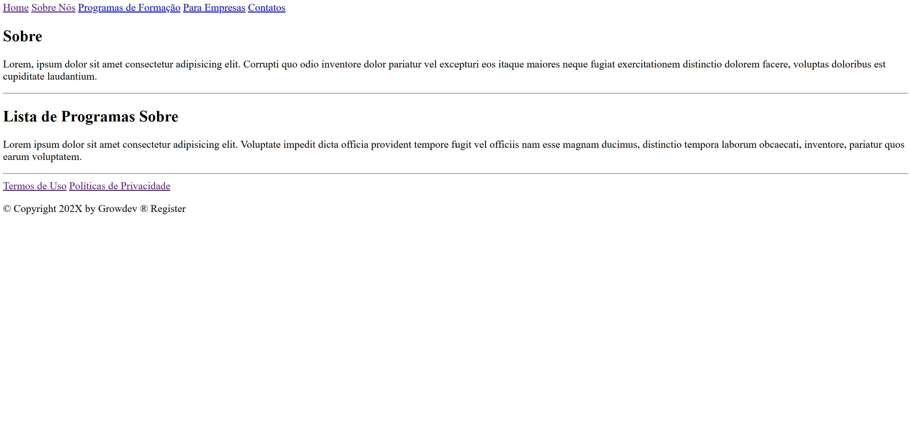

# Atividade Prática 1:  Projeto: Growdev - Plataforma de Desenvolvimento Web

**Esse projeto é uma inspiração da plataforma Growdev, que é um ambiente online voltado para o desenvolvimento web, oferecendo cursos, mentoria personalizada e uma comunidade ativa. Nossa missão é capacitar profissionais e entusiastas da área, fornecendo conhecimento prático e atualizado.**

#### Tecnlogias Utilizadas

- HTML

Site de referência do projeto: [Growdev](https://www.growdev.com.br/)